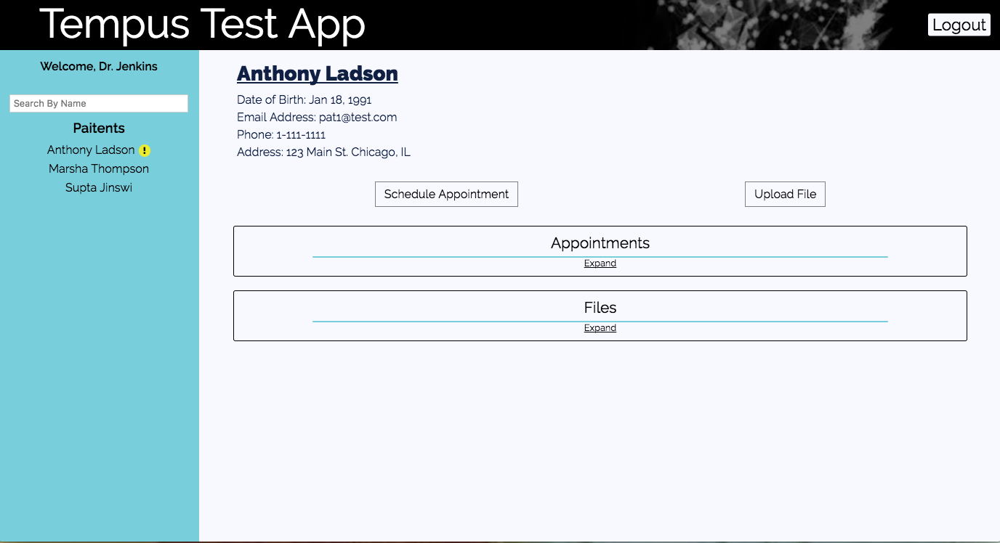
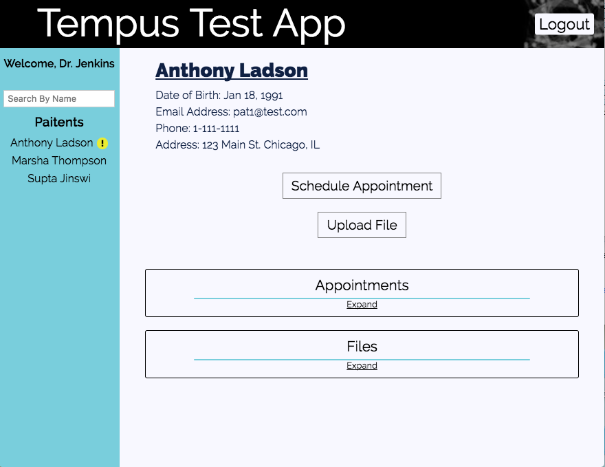
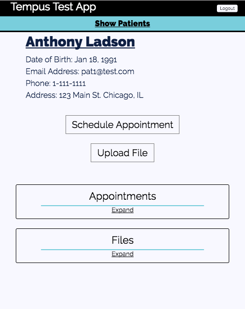

# Getting Started

0. Navigate to root
1. Run `npm install`
2. Run `./node_modules/.bin/webpack` to build the bundle file
2. Run `node server.js` to start server. Opens on port 3000.
3. Run `npm run e2e` to run end-to-end testing with nightwatchjs. Server must be running.
4. Visit `http://localhost:3000/` to browse the site.

# Tempus Code Walkthrough

### Libraries and Configurations

* **package.json** - Our `package.json` lists all of our dependencies. We are using `babel` to transpile our ES6, JSX, and SCSS code. We are using the `express` framework along with some middleware, but to make the server development a little easier. And finally, we are bring in several `react` modules, which we'll use as our client framework. T

* **webpack.config.js** - The `webpack.config.js` just specifies that we are creating a `bundle.js` file in our `public/javascripts` directory. One thing that I want to point out is that I'm also bundling SCSS with the ES6/JSX `bundle.js` file. I really enjoy this as it allows me to import the specific CSS I need for a particular react module. This makes the CSS a lot more maintainable, in my opinion.

* **nightwatchjs.conf.js** - This is my first time using nightwatchjs, so I admittedly ripped this file from an online tutorial. I added one line to the top (`require('./db/reset')`) that simply resets the database.

### The Server

* **server.js** - This is the file that starts the server. It's really simple, but I'll point out three things.
  1. I'm using some middleware between lines 14-17. These allow me to use cookies for login purposes and the parse request body data. It also sets up the static directory.
  2. On line 24, I am using a router that was defined in another file. This catches any request to the api.
  3. On line 26, I match any path that didn't get caught by the router and return the `views/index.ejs` file. The reason is so that the React-Router's `BrowserHistory` works.

* **RESTful API** - All data is created, modified, or destroyed from a RESTful api. This code lives in `routes.js`. It's pretty standard; I use the common HTTP verbs and common url patterns for matching. Everything is name-spaced under `/api/`. I made the assumption that the API would only be used by the app, and so I've implemented a csfr protection to prevent malicious, foreign requests.

* **The Database** - I used a Sqlite3 database, but it's very extendable because I used an ORM called Sequelize. I chose Sqlite3 for speed of development, but because I'm using an ORM, the database could be easily updated to fit new requirements. There are three files in the `db/` directory:
  1. `db_connection.js` - Sets up and interfaces with Sequelize.
  2. `models.js` - defines all the models used in the app.
  3. `reset.js` - resets the database. This is automatically run if you run the test cases.

* **MVC Pattern** - I roughly follow the famous model-view-controller pattern. The models are defined in `db/models.js`. The view is in `views/index.ejs`; it delivers the application root `div`. The controllers are defined `controllers/`:
  1. `SessionController` - handles logging in, logging out, and fetching the current user.
  2. `PatientController` - handles everything that deals with the patient, including updating/saving/deleting appointments and files.
  3. `DoctorController` - a small controller; all it does to return all the doctors

* **Cloud Storage** - I do not make any assumption about the possible file types that could be uploaded. I could have easily put constraints on both the front and backend, but I decided not to in this case. I store the file in Cloudinary and retain a reference to it's url. `cloud_storage.js` interfaces with the Cloundinary API.

### The Frontend

* **React/Redux/Router** - My frontend framework uses React for creating visual interfaces, Redux for managing state, and ReactRouter for synchronizing the url path to current state of React components. There are 5 directories:
  1. `actions` - Application state can only be changed by dispatching an action. All the actions are kept in this folder.
  2. `components` - This is where all the visual elements of application live. Each folder represents are particular component and it's dependencies. `root.jsx` wraps the entire component in the redux `Provider` and ReactRouter's `BrowserHistory`. `app.jsx` defines the major routes and their corresponding components.
  3. `store` - This is where the application state lives, aka the store. The door is a combination of several reducers, each defined in their own file. A reducer specifies how an action effects the state.
  4. `style` - As I mentioned earlier, my scss in bundled together with my js, specifically the components. I find it more manageable to include specific scss files with specific components. So, I house all of my scss in the `frontend` folder.
  5. `util` - There are two main type utility methods I used: API and Routes. API utility methods use AJAX to make API calls to the backend. Route utility methods are authentication wrappers (i.e. make a route require a login)

* **Routes**

* **Style** - The site is designed to be responsive.

Large Screen

Medium Screen

Small Screen

* **Patient View Reuse**

## public/ and views/

The `public` directory really only has the `bundle.js` file. The `views` directory has the root of the application. There's the `div` that React will hook on to, as well as a few scripts/links.

## routes.js

This file is the router. For the sake of controlling complexity, I went with the MVC pattern. The router determines which controller and action should process the request. Pretty standard. I should mention that the router only handle request made to `/api/*` paths. The html is given by line 26 in `server.js`.

## controllers/

This is the directory where all of the controllers live. There are three controllers.

The controller rely on two modules:

1. `db/util.js` - This file provides utility methods that modify the data.
2. `cloud_storage.js` - Files are saved to Cloudinary and displayed with iframes. The modules interfaces with the cloudinary api.

## frontend

This is where all the client JS code lives. It eventually becomes the `bundle.js` file. I'm using `react`, `react-router`, and `redux`. I think I named my directories appropriately. All the actions are int eh `actions/` directory; same for the `store`.

### main.jsx and components/root.jsx

### app.jsx

### Containers
