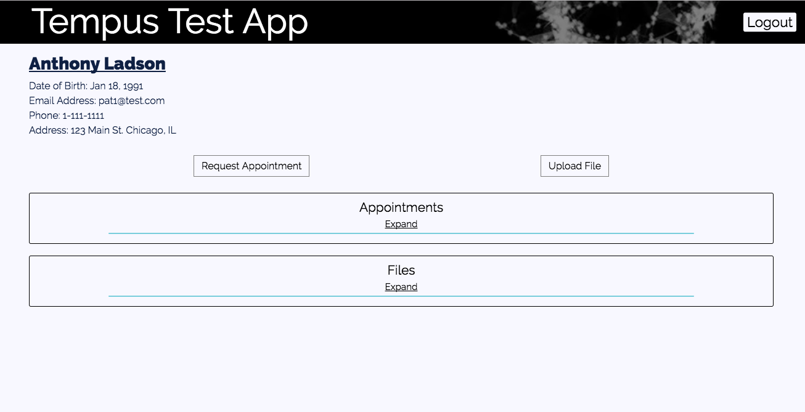
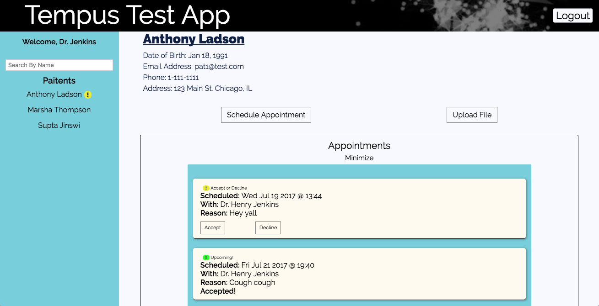
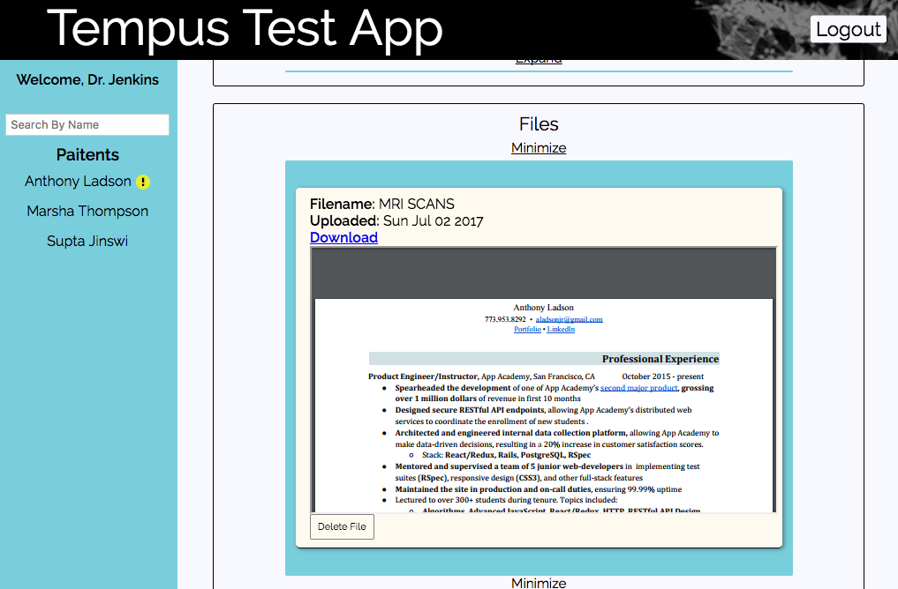
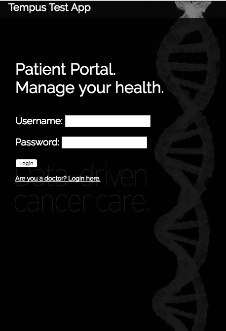
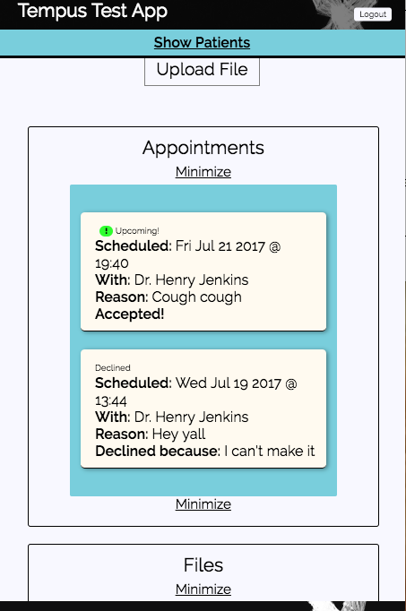
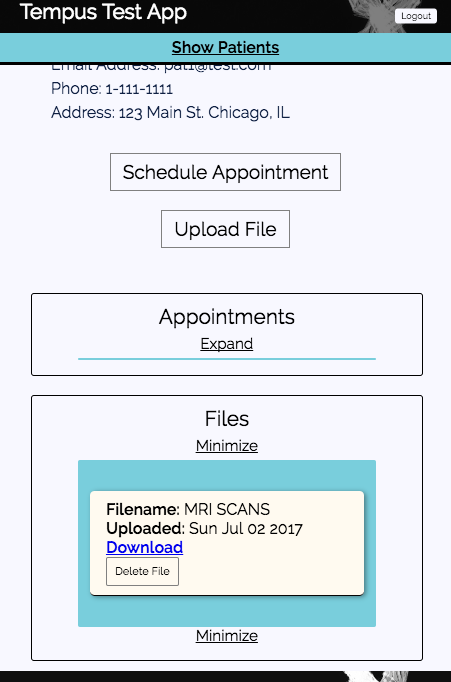
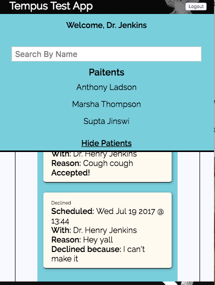

# Getting Started

1. Run `npm install`
2. Run `node db/reset.js` to initialize the database
4. Run `npm test` to run end-to-end testing with nightwatchjs.
5. Run `npm start` to start server. Opens on port 3000.
  * Visit `http://localhost:3000/` to browse the site.

### or use Docker

* Download image from registry: `docker pull ailadson/tempus:v2`
* Run `docker run -p 3000:3000 ailadson/tempus`
* Visit `http://localhost:3000/` to browse the site.

### Credentials

Be sure to run `node db/reset.js`.

Email Address | Password | Account Type
--------------|----------|-------------
pat1@test.com |   p1     |  Patient
pat2@test.com |   p2     |  Patient
pat3@test.com |   p3     |  Patient
doc1@test.com |   p1     |  Doctor
doc2@test.com |   p2     |  Doctor

# Tempus Code Walkthrough

### Libraries and Configurations

* **package.json** - The `package.json` lists all of our dependencies.
  * I'm using `babel` to transpile our ES6, JSX, and SCSS code. The loaders for each must also be installed.
  * The `express` framework - along with some middleware - to make server development a little easier.
  * The frontend is going to use the `react` and `redux` modules.
  * Finally, the necessary testing modules.

* **webpack.config.js** - The `webpack.config.js` specifies that we are creating a `bundle.js` file in our `public/javascripts` directory. One thing that I want to point out is that I'm also bundling scss with the ES6/JSX `bundle.js` file. Said differently, I'll be able to import scss directly into javascript files. This makes the CSS a lot more maintainable, in my opinion.

* **nightwatchjs.conf.js** - This is my first time using nightwatchjs, so I admittedly ripped this file from an online tutorial. I only added one line to the top (`require('./db/test_reset')`), which simply resets the test database.

### The Server

* **server.js** - This is the file that starts the server. It's really simple, but I'll point out three things.
  1. I'm using some middleware that will allow me to use cookies for login purposes, parse request body data, manage csfr (cross-site request forgery) tokens, and setup the static directory.
  2. I am using a router that was defined in another file. This catches any request made to the API.
  3. I also match any path that didn't get caught by the router and return the `views/index.ejs` file. The reason is so that the React-Router's `BrowserHistory` works and we get pretty URLs.

* **RESTful API** - All data is created, modified, or destroyed through a RESTful API. The endpoints are defined in `routes.js`. It's pretty standard; I use the common HTTP verbs and common URL patterns for matching. Everything is name-spaced under `/api/`. I made the assumption that the API would only be used by the app, and so I've implemented a csfr protection to prevent malicious, foreign requests. If called for, I could develop an key system that allows other sites to use the API.

* **The Database** - I used a Sqlite3 database, but it's very extendable because I used an ORM called Sequelize. I chose Sqlite3 for speed of development, but, because I'm using an ORM, the database could easily be updated to fit new requirements. There are three files in the `db/` directory that I want to point out:
  1. `db_connection.js` - Sets up and interfaces with Sequelize.
  2. `models.js` - defines all the models used in the app.
  3. `reset.js` - resets the database. This is automatically run if you run the test cases.

* **MVC Pattern** - I roughly follow the famous model-view-controller pattern. The models are defined in `db/models.js`. The view is in `views/index.ejs`; it delivers the application root `div`. The controllers are defined `controllers/`:
  1. `SessionController` - handles logging in, logging out, and fetching the current user.
  2. `PatientController` - handles everything that deals with the patient, including updating/saving/deleting appointments and files.
  3. `DoctorController` - a small controller; all it does to return all the doctors

* **Cloud Storage** - I assume that users will only upload [csv/json/pdf/txt/tsv/xml] files. I store the files with Cloudinary and retain a reference to it's url. `cloud_storage.js` interfaces with the Cloundinary API.

### The Frontend

* **React/Redux/Router** - My frontend framework uses React for creating visual interfaces, Redux for managing state, and ReactRouter for synchronizing the url path to current state of React components. There are 5 directories:
  1. `actions` - Application state can only be changed by dispatching an action. All the actions are kept in this folder.
  2. `components` - This is where all the visual elements of application live. Each folder represents are particular component and it's dependencies. `root.jsx` wraps the entire component in the redux `Provider` and ReactRouter's `BrowserHistory`. `app.jsx` defines the major routes and their corresponding components.
  3. `store` - This is where the application state lives, aka the store. The store is a combination of several reducers, each defined in their own file. A reducer specifies how an action effects the state.
  4. `style` - As I mentioned earlier, my scss in bundled together with my js, specifically the components. I find it more manageable to include specific scss files with specific components. So, I house all of my scss in the `frontend` folder.
  5. `util` - There are two main type utility methods I used: API and Routes. API utility methods use AJAX to make API calls to the backend. Route utility methods are authentication wrappers (i.e. make a route require a login)

* **Responsive Design** - The site is designed to be responsive. Below are screenshots at different sizes:

#### Larger Screens
</img>
</img>
</img>
</img>

####  Smaller Screens
</img>
</img>
</img>
</img>

* **Other Notes**
  * Doctors can only delete their own appointments
  * Appointments are listed in the following order: PENDING, ACCEPTED, DECLINED, PAST
  * Doctors are alerted to which patients they have pending appointments with.
  * Loading screen. (File uploads because it can take a while).
  * Background video becomes an image on smaller screens.

 ### Caveats
  * I've put a secrets.json file up on Github. I'm not that naive; I'll be changing those secrets within the week. Only doing it so you can smoothly check my work
  * I don't have a password length requirement, and I don't salt-n-hash the passwords on the backend. If I were developing a real application, I'd of course have done this. But then it would slow down manual testing. If I had wanted to implement a more robust authentication system, I'd have used `passport` or `bcrypt`.
